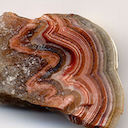
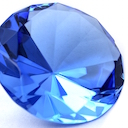

My PhD research broadly covers operating systems and distributed
systems for large-scale, distributed applications.

<ul class="media-list">
    <li class="media">
		

    
	

	

<a href="{{ site-base }}/papers/tapir-sosp15.pdf" class="btn btn-default btn-xs"> Paper</a>
<a href="https://github.com/UWSysLab/tapir" class="btn btn-default btn-xs"> Code</a>
<a href="tapir/index.html" class="btn btn-default btn-xs"> More</a>

<h4 class="media-heading">TAPIR</h4>

The Transactional Application Protocol for Inconsistent Replication
(TAPIR) is a new protocol for linearizable distributed transactions
built using replication with <em>no consistency guarantees</em>. By
enforcing consistency <em>only</em> at the transaction layer, TAPIR
eliminates coordination at the replication layer, enabling TAPIR to
provide the same transaction model and consistency guarantees as
existing systems like Spanner with better latency and throughput.

</li>

    <li class="media">
		

			
	

	

	

<a href="https://github.com/UWSysLab/diamond" class="btn btn-default btn-xs"> Code</a>
<a href="//sapphire.cs.washington.edu/research/project/diamond.html" class="btn btn-default btn-xs"> More</a>

	<h4 class="media-heading">Diamond</h4>

Diamond is a new data management system for wide-area, reactive
applications.  Reactive applications give users the illusion of
continuous synchronization across mobile devices and the cloud server.
Diamond simplifies this task by providing applications with persistent
cloud storage, reliable synchronization between storage and mobile
devices, and automated execution of application code in response to
shared data updates.  </li>

    <li class="media">
		

			
	

	

	
    
<a href="https://github.com/SapphireAgate" class="btn btn-default btn-xs"> Code</a>
<a href="//sapphire.cs.washington.edu/research/project/agate.html" class="btn btn-default btn-xs"> More</a>

	<h4 class="media-heading">Agate</h4>

Agate is a new trusted distributed runtime system that gives users
control over how mobile/cloud applications share sensitive user data
collected on mobile devices (e.g., photos, GPS location).  Agate
combines aspects of access control and information flow control to
allow applications to share user data in application-specific ways,
while enforcing user policies without trusting the application or the
application programmer.

</li>

    <li class="media">
		

			
	

	

<a href="{{ site-base }}/papers/sapphire-osdi14.pdf" class="btn btn-default btn-xs"> Paper</a>
<a href="https://github.com/UWSysLab/Sapphire" class="btn btn-default btn-xs"> Code</a>
<a href="//sapphire.cs.washington.edu" class="btn btn-default btn-xs"> More</a>

<h4 class="media-heading">Sapphire</h4>

Sapphire is a new distributed programming platform that provides
customizable and extensible deployment of mobile/cloud applications.
This flexibility enables programmers to separate deployment logic from
their application, while maintaining fine-grained control over
performance trade-offs.

</li>

    <li class="media">
		

			
	

	

<a href="{{ site-base }}/papers/arrakis-osdi14.pdf" class="btn btn-default btn-xs"> Paper</a>
<a href="https://arrakis.cs.washington.edu/?page_id=52" class="btn btn-default btn-xs"> Code</a>
<a href="//arrakis.cs.washington.edu" class="btn btn-default btn-xs"> More</a>

<h4 class="media-heading">Arrakis</h4>

Arrakis is a new operating system that takes advantage of hardware
virtualization technology to eliminate the operating system from
fast-path I/O operations. Arrakis allows applications to directly
access the hardware during normal execution, providing significantly
better performance, reliability and customizability.
 

</li>

</ul>

Before starting my PhD, I worked on several research projects at
VMware and MIT. You can find out more about my [past projects here ](past.html).

