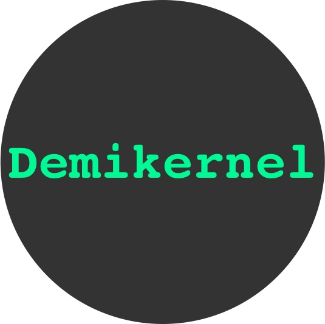

My current research focuses on datapath operating systems for
microsecond-scale datacenter systems.

<ul class="media-list">
<li class="media">

    
    <a href="papers/demikernel-sosp21.pdf" class="btn btn-default btn-xs"> Paper</a>
    

    <h3 class="media-heading">Demikernel</h3>
    The Demikernel is a new datapath OS and architecture for
    microsecond-scale datacenter systems and kernel-bypass devices.
    Demikernel accommodates heterogenous kernel-bypass devices with a
    flexible library OS architecture and new high-level datapath API
    with an asynchronous I/O interface and zero-copy memory
    semantics for microsecond I/O processing.  Demikernel implements
    this API for RDMA, DPDK and SPDK devices with new nanosecond-scale
    I/O stacks in Rust.  Once ported to Demikernel, microsecond
    datacenter systems can run across different devices with no code changes.
     
    

</li>

</ul>

## Past Research

My PhD research broadly covered distributed systems for large-scale,
wide-area applications. Some recent projects are listed below.

<ul class="media-list">

<li class="media">

    
    <a href="papers/treehouse-arxiv22.pdf" class="btn btn-default btn-xs"> Paper</a>
    
<h3 class="media-heading">Treehouse</h3>

Treehouse is new project that proposes a software-centric approach to
green datacenters. While existing research aims to reduce energy usage
of datacenter hardware, we argue that being energy-aware in the design
of datacenter software is equally important.  To that end, Treehouse
aims to make energy and carbon visible to application developers on a
fine-grained basis, modify system APIs to make informed trade offs
between performance and carbon emissions, and raise the level of
application programming for flexible use of more energy efficient
means of compute and storage. Find out more about the Treehouse project at our <a href="https://treehouse-research.github.io">project webpage</a>!
     
    

</li>

<li class="media">

    
    <a href="papers/marvin-tr19.pdf" class="btn btn-default btn-xs"> Paper</a>
    

    <h3 class="media-heading">Marvin</h3>
    Marvin is a new memory manager for Android that co-designs the
    application runtime (i.e., JVM) and operating system.
    Marvin's key insight is that all mobile applications run within
    the <i>same</i> runtime, so we can leverage  runtime insight into the
    application for better  resource management.  Marvin implements
    almost all memory management in a modified Android Runtime to
    achieve better  memory utilization and performance.
     
    

</li>

</ul>

